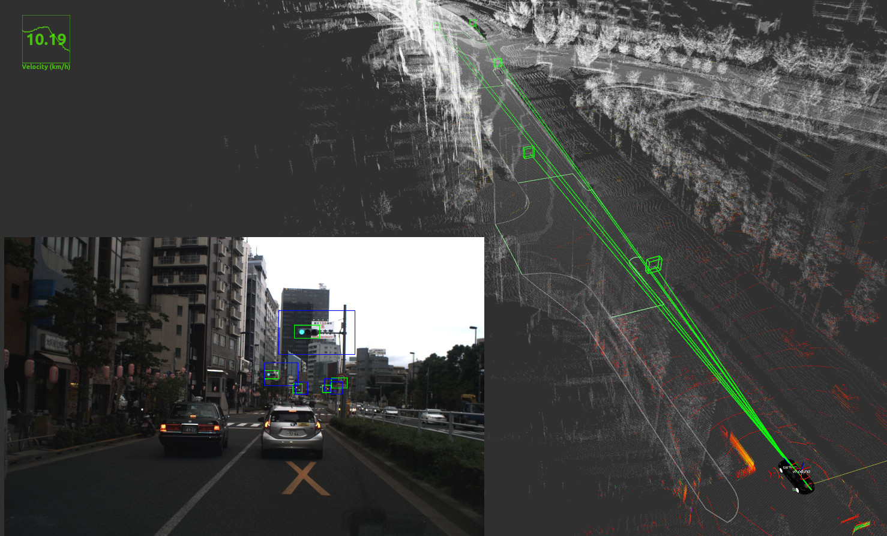
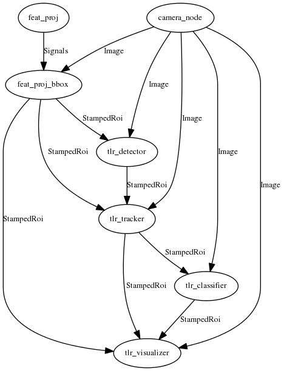

# new_trafficlight_recognizer



## System

```
@startuml
digraph G {
graph [layout = dot];
node [color = black, fontsize = 10];
edge [color = black, fontsize = 10, style = "solid,filled"];
camera_node -> feat_proj_bbox [label="Image"]
feat_proj -> feat_proj_bbox [label="Signals"]
feat_proj_bbox -> tlr_detector [label="StampedRoi"]
camera_node -> tlr_detector [label="Image"]
camera_node -> tlr_tracker [label="Image"]
tlr_detector -> tlr_tracker [label="StampedRoi"]
feat_proj_bbox -> tlr_tracker [label="StampedRoi"]
camera_node -> tlr_classifier [label="Image"]
tlr_tracker -> tlr_classifier [label="StampedRoi"]
camera_node -> tlr_visualizer [label="Image"]
feat_proj_bbox -> tlr_visualizer [label="StampedRoi"]
tlr_tracker -> tlr_visualizer [label="StampedRoi"]
tlr_classifier -> tlr_visualizer [label="StampedRoi"]
}
@enduml
```

## Demo videos
There are two trafficlight recognizer

 - **This packege** (new version)

   demo video\
   in preparation   


 - **higashide developed trafficlight recognizer** (old version)

   git hub repository\
   https://github.com/taichiH/autoware/tree/update_traffic_light/ros/src/computing/perception/detection/trafficlight_recognizer

   demo video\
   https://drive.google.com/file/d/1N4u6A5zNbR9bgCQ-EUnbDLKyBjW72RmO/view

## Dependencies
 - ROS
 - autoware
 - chainer 6.2.0
 ```
 pip install chainer==6.2.0
 ```
 - chainercv 0.13.1
 ```
 pip install chainercv=0.13.1
 ```

## Instalation
Clone git repository on your ros workspace
```
https://github.com/tier4/new_traffic_light_recognition
```

 - install ros dependencies for traffic_light_recognition
 ```
 rosdep install -y -r --from-paths --ignore-src src
 ```
 - build
 ```
 catkin_make
 ```

## Downloads
download ssd trained data from google drive\
https://drive.google.com/drive/u/0/folders/1-qx1CtGyOaoeTITFFaJzLYiPbWr0Ams1

Set `trafficlight_ssd300.npz` inside `new_trafficlight_recognizer/data` directory.

## run with shinjuku-rosbag

### run autoware

 **on Simulation Tab**
 ```
 set `rosbag/shinjuku_autoware_evaluation.bag` file.
 ```

 **on Setup Tab**
 ```
 push TF and  Vehicle Modelbutton
 (Vehicle Model button is empty bu default)
 ```

 **on Map Tab**
 ```
 set point clound data to `Point Cloud` tab.
 set vector map to `Vector Map` tab.
 set tf to `TF` tab.
 ```

 **on Sensing Tab**
 ```
 launch `voxel_grid_filter`
 ```

 **on Computing Tab**
 ```
 launch `nmea2tfpose` , `ndt_matching` , `vel_pose_connect`
 ```

 **on Sensing Tab**
 ```
 rosrun image_transport republish compressed in:=/camera0_rotated/image_raw raw out:=/image_raw

 push Calibration Publisher button
 - Camera ID = /
 - calibration/calibration.yaml
 ```

### run trafficlight_recognizer
```
roslaunch new_trafficlight_recognizer trafficlight_recognizer.launch
```


## 引継ぎ事項

### 概要
このパッケージは信号検出のためのパッケージです。\
大きく分けて、5つの機能があり、以下それぞれの説明になります。\
またこれらの機能は`nodes` ディレクトリ以下のディレクトリに対応します。

 - **feat_proj**
   
   - **input**
   
   vector map infomation

   - **output**

   projected rects
   ```
   ~output_projected_roi (autoware_msgs/StampedRoi)
   ```

   - **description**
   ```
   ベクターマップに予め登録されている信号機の3次元位置を受け取り、カメラ画像上に射影し、
   画像上での大まかな信号機の位置を表す2次元矩形を作成します。
   出力は各信号機の大まかな位置を表す矩形の配列になります。
   ```

 - **tlr_detector**

   - **input**
   
   raw_image
   ```
   ~input_image (sensor_msgs/Image)
   ```

   projected rects (output of feat_proj)   
   ```
   ~input_stamped_roi (autoware_msgs/StampedRoi)
   ```

   - **output**

   detected rects
   ```
   ~output_stamped_roi (autoware_msgs/StampedRoi)
   ```

   - **description**
   ```
   カメラ画像とfeat_projによって作成された各信号機の矩形情報から切り取った画像の配列を作成し、
   そのすべての画像に対してSSD300による信号検出を行います。

   各画像中で複数の信号が検出される可能性があるが、そのなかからもっともスコアの高い一つを選び、
   その結果を出力します。
   ```

 - **tlr_tracker**

   - **input**

   raw_image
   ```
   ~input_image (sensor_msgs/Image)
   ```

   ssd detection results (output of tlr_detector)
   ```
   ~input_detected_boxes (autoware_msgs/StampedRoi)
   ```

   projected rects (output of feat_proj)
   ```
   ~input_stamped_roi (autoware_msgs/StampedRoi)
   ```

   - **output**

   tracked boxes
   ```
   ~output_rois (autoware_msgs/StampedRoi)
   ```

   - **description**
   ```
   tlr_detectorによる検出は場合によっては遅れを伴う可能性があり、リアルタイム(毎フレーム)で信号を
   検出できる保証がありません。また、SSDによる検出に失敗した場合、その間も信号を見失った状態になります。
   これら2つの問題に対処するために追跡を行います。

   しかし現在はSSDによる検出結果を信じるようにしてあり、検出がされない場合は追跡すべきではないと判断します。
   そのためフレーム間の補間が主な役割になります。
   ```

 - **tlr_classifier**

   - **input**

   raw_image
   ```
   ~input_image (sensor_msgs/Image)
   ```

   tracked rects (output of tlr_tracker)
   ```
   ~input_stamped_roi (autoware_msgs/StampedRoi)
   ```

   - **output**

   trafficlight states
   ```
   ~output_light_states (autoware_msgs/TrafficLightStateArray)
   ```

   - **description**
    ```
    tlr_detector, tlr_trackerによって検出された各信号機の位置を表す矩形に対して、
    色認識による信号機のステートの判断をします。
    例えば、赤、青、黄などが認識されます。
    また、矢印への対応もできるように設計されていますが、現在開発中の項目となります。
    ```

 - **tlr_visualizer**

   - **input**

   raw_image
   ```
   ~input_image (sensor_msgs/Image)
   ```

   projected rects (output of feat_proj)
   ```
   ~input_stamped_roi (autoware_msgs/StampedRoi)
   ```

   tracked rects (output of tlr_tracker)
   ```
   ~input_stamped_roi (autoware_msgs/StampedRoi)
   ```

   trafficlight states
   ```
   ~input_light_states (autoware_msgs/TrafficLightStateArray)
   ```

   - **output**

   visualization image
   ```
   ~output_vis_image (sensor_msgs/Image)
   ```

   visualization lines (describe line from car to trafficlight on rviz)
   ```
   ~output_vis_lines (visualization_msgs/MarkerArray)
   ```

   visualization 3d boxes (describe boxes arround each trafficlight on rviz)
   ```
   ~output_vis_boxes (jsk_recognition_msgs/BoudningBoxArray)
   ```

   - **description**
   ```
   上記の4つの認識結果をそれぞれ受け取り、画像やrviz上に検出結果を表示します。
   ```

## 開発途中のものリスト

**tlr_classifier**
 - 色の調整をdynamic_reconfigureまたはruntime managerなどのGUIで操作できるようにする
 - c++で矢印を認識できるようにする

**tlr_tracker**
 - MultiKcfTrackerにより各ROIに対して順にトラッキングを行うが、これを並列で行うようにする。

**tlr_detector**
 - chainerの学習済みモデルをtensorrtに変換
 - tensorrtによりinferenceするros nodeの作成

**tlr_visualizer**
 - 信号の色、矢印認識結果をimageまたはrvizに表示できるようにする。
 - jsk_recognition_msgs/BoudningBoxArray でpublishしているが、余計な依存を減らすため、visualization_msgsで出すようにする。


**tests**
 - 現在は最小限プログラムが機能するかどうかくらいのテストしかできていないので、アブノーマルなinputへのテストなどを追加していく
 - traffic_light_recognizerのtestだけ別なスタイルになっているので、これもautowareの他のunit testと同様の書き方に変えていく


## chainerによるSSDの学習方法

### 信号機のアノテーション画像について

 - 現状
   1. 斎藤さん、村上さんによって集められた本郷近辺の車載画像データから東出が手動でアノテーションしたもの
   2. imagenetのtrafficlightラベルのついたbbox

   現在は1と2を合体したアノテーションデータセットを用いて信号検出をしています。
   
 - これからの展望

   アノテーション請負会社によってアノテーションされたデータセットがすでにあるので、それらを使ってさらに学習をすすめる。
   

### 検出モデルについて
 - 現状

   SSD300を使っているが、GPUがない環境での対応なども考えmobilenetなどの軽量モデルを試したりもしている。

 - これからの展望

   基本的にGPUを使うという前提で検出はデータセット集めと学習だけにとどめ、識別などに注力する

### 学習方法
これから書きます